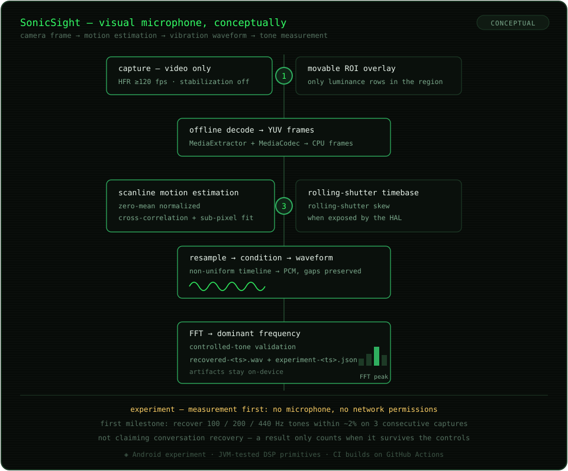

# SonicSight

SonicSight is an experimental Android **visual microphone / optical vibrometry** project. It uses the camera to measure microscopic motion in a visible object and reconstruct a vibration waveform without requesting microphone access.

The project is intentionally measurement-first. The near-term goal is to prove repeatable frequency recovery on ordinary Android hardware before attempting intelligible speech reconstruction.

## Current state

- Camera2 capability probe for rear-camera HFR modes, OIS, and EIS.
- CameraX 1.6.2 high-speed recording when the device exposes a fixed >=120 FPS mode.
- Standard-video fallback for rolling-shutter experiments.
- Preview and video stabilization disabled during measurement.
- Movable region-of-interest overlay.
- Video-only recording. No `RECORD_AUDIO` permission and no network permission.
- Offline `MediaExtractor` + `MediaCodec` YUV decoding.
- Scanline motion estimation using zero-mean normalized cross-correlation plus sub-pixel interpolation.
- Rolling-shutter timebase using Camera2 `SENSOR_ROLLING_SHUTTER_SKEW` when available.
- Non-uniform-to-PCM resampling that preserves frame gaps.
- Basic signal conditioning and local WAV export.
- FFT-based dominant-frequency measurement for controlled-tone validation.
- Local JSON experiment records containing device, camera, ROI, timing, and spectral results.
- JVM unit tests for the core DSP primitives.
- GitHub Actions Android build/test workflow.

## Scientific boundary

SonicSight does **not** currently claim that a normal phone can recover arbitrary room conversations by simply pointing the camera anywhere. The first validated target is a deliberately responsive visible object such as foil, thin packaging, paper, a lightweight cup wall, or a speaker cone.

A result only counts when it survives controls: source off, target damped, rigid-background ROI, repeated captures, and source-frequency changes.

## First milestone

Recover known **100 Hz, 200 Hz, and 440 Hz** tones within roughly 2% on three consecutive captures from at least one visible target on a regular Android phone.

See [`TESTING.md`](TESTING.md) for the device protocol and [`docs/ARCHITECTURE.md`](docs/ARCHITECTURE.md) for the processing pipeline.

## Build

Requirements:

- JDK 17
- Android SDK / compileSdk 37
- Android Gradle Plugin 9.3.0
- Gradle 9.5.0
- CameraX 1.6.2
- Physical Android device, API 28+

Open the repository in a current Android Studio and run the `app` configuration on a physical device. The current repository includes the Gradle wrapper configuration but not the wrapper JAR; the CI workflow provisions Gradle 9.5.0 directly. Once the development environment is connected, regenerate and commit the standard wrapper with `gradle wrapper`.

## Output

After analysis, SonicSight writes two private app files:

- `recovered-<timestamp>.wav` — reconstructed vibration waveform.
- `experiment-<timestamp>.json` — device/camera/timing/ROI metadata and the dominant spectral peak.

These artifacts stay local to the device in the current prototype.

## Roadmap

1. Validate the current scanline estimator on a Pixel with controlled tones.
2. Calibrate sensor readout timing per device/camera mode.
3. Lock exposure/focus where supported and measure how exposure affects usable bandwidth.
4. Add rigid-background rejection and multi-region consensus.
5. Replace/augment correlation with phase-based sub-pixel motion extraction.
6. Add objective SNR/repeatability scoring and waveform inspection.
7. Test speech-like excitation only after tone recovery is repeatable.

## Privacy posture

SonicSight is designed as an explicit foreground measurement tool. The Android manifest requests camera access only. It intentionally does not request microphone or internet permissions.

---

*An experiment by [Hans Sai](https://builtbysai.com).*
